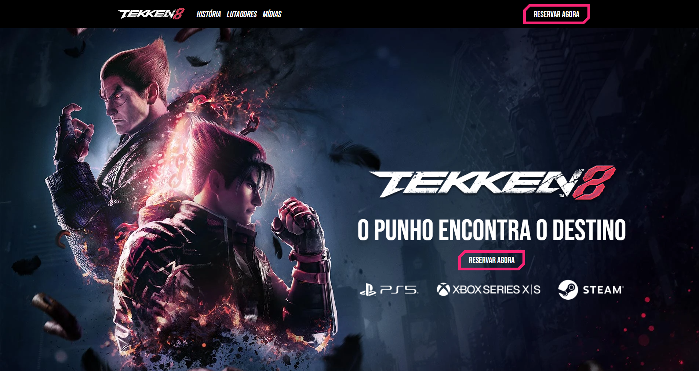

# Tekken 8 - Site Clone

Este projeto é um clone do site oficial do Tekken 8, construído com HTML, CSS, JavaScript, jQuery e Bootstrap. Ele visa replicar a interface e funcionalidades principais do site oficial do jogo.
Clique [aqui](https://richard-tavares.github.io/tekken8/) para visualizar.

## Screenshot

## Funcionalidades

- Replica a interface do site oficial do Tekken 8.
- Utiliza jQuery para interações dinâmicas.
- Responsivo com o uso do Bootstrap para uma experiência multi-dispositivos.

## Tecnologias Utilizadas

- **[HTML](https://developer.mozilla.org/pt-BR/docs/Web/HTML)**
- **[CSS](https://developer.mozilla.org/pt-BR/docs/Web/CSS)**
- **[Javascript](https://developer.mozilla.org/pt-BR/docs/Web/JavaScript)**
- **[Bootstrap](https://getbootstrap.com/docs/)**

## Estrutura do Projeto

O projeto está organizado da seguinte forma:
- `index.html`: Página principal do site.
- `css/`: Pasta contendo os arquivos de estilo CSS.
- `js/`: Pasta contendo os arquivos JavaScript e jQuery.
- `images/`: Pasta com as imagens utilizadas no site.

## Autor

[@richard-tavares](https://github.com/richard-tavares)

## Aviso Legal

Este é um projeto desenvolvido apenas para fins educacionais e de aprendizado. Todo o conteúdo, incluindo imagens, logotipos, marcas registradas e qualquer outro material relacionado ao Tekken 8, é propriedade da Bandai Namco Entertainment.

**Todos os direitos relacionados ao Tekken 8 são reservados à Bandai Namco Entertainment. Este projeto é uma demonstração de habilidades de desenvolvimento web e não tem a intenção de infringir ou competir com os direitos de propriedade intelectual da Bandai Namco Entertainment.**

Este projeto não é oficial, não está afiliado à Bandai Namco Entertainment e não tem relação direta com a empresa. O objetivo é puramente educacional e de demonstração técnica.
